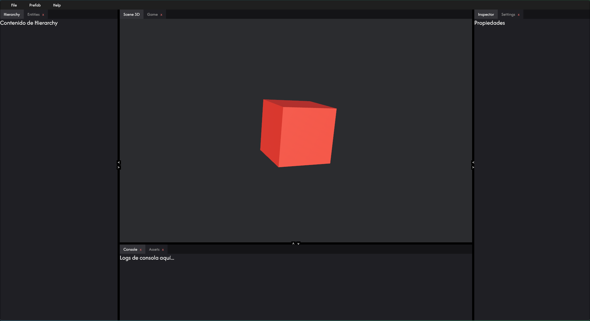
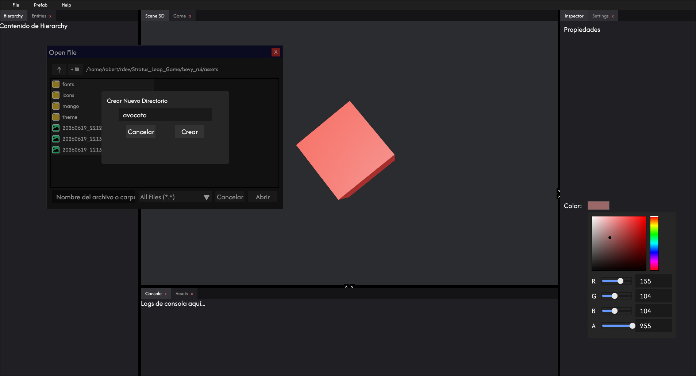
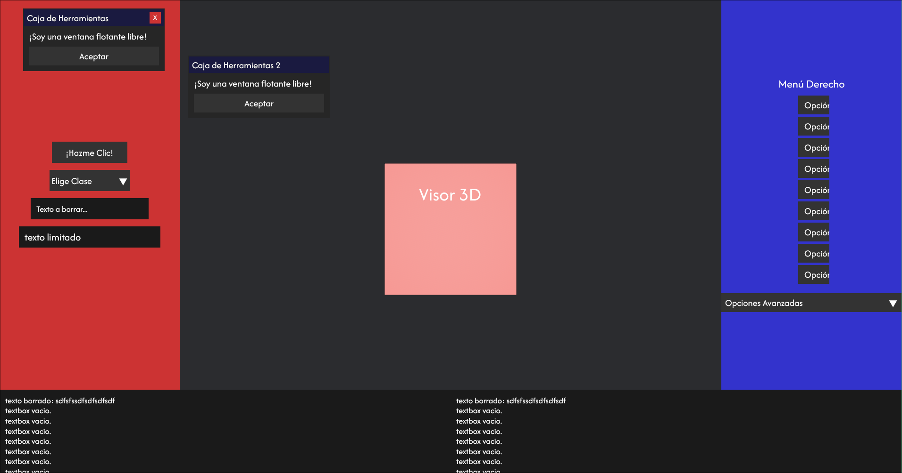
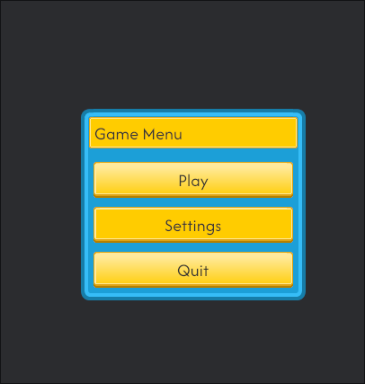

# bevy_rui

These are the 3 demos included. for the game demo you need the [kenney ui assets pack ](https://https://kenney-assets.itch.io/ui-pack)

* the texture for the widgets are not finish.
* if you want to support the project [ko-fi goal](https://ko-fi.com/robertxy/goal?g=1) or [ko-fi member](http://ko-fi.com/robertxy/tiers)

## Widgets

* Acordion menu
* Button
* Checkbox
* Color Picker
* Dock
* Dropdown
* Label
* Menu
* Open/Save dialog
* Slider
* Tabs
* Textbox
* Tooltip
* Viewport
* Windows

## Images

[dock demo](https://github.com/prfiredragon/bevy_rui/blob/main/examples/layout_dock.rs)

[Layout dock save](https://github.com/prfiredragon/bevy_rui/blob/main/examples/layout_dock_save.rs)

[layout demo](https://github.com/prfiredragon/bevy_rui/blob/main/examples/layout_test.rs)

[game menu demo](https://github.com/prfiredragon/bevy_rui/blob/main/examples/game_test.rs)

